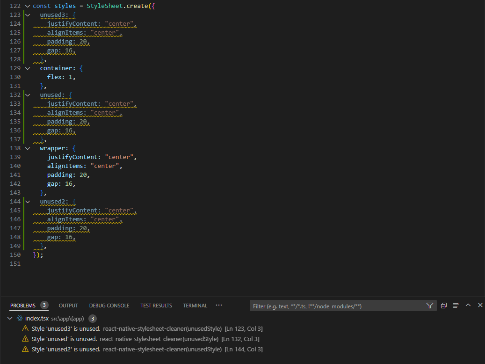

# React-Native-StyleSheet-Cleaner


This VS Code extension helps clean up unused styles in React Native projects. It identifies and removes unused styles from your stylesheets, making your code cleaner and more maintainable.



### Features

1. **Identify Unused Styles**: Scans your React Native stylesheets and identifies styles that are not used anywhere in your code.
2. **Remove Unused Styles**: Provides commands to remove all unused styles or a single unused style.
3. **Diagnostics**: Highlights unused styles in your code with warnings.
4. **Auto Clean on Save**: Optionally, automatically clean unused styles when you save your file.

### Requirements

- Visual Studio Code version 1.96.0 or higher.
- Works with JavaScript React (`.jsx`) and TypeScript React (`.tsx`) files.

### Extension Settings

This extension contributes the following settings:

- `react-native-stylesheet-cleaner.autoCleanOnSave`: Enable/disable automatic cleaning of unused styles on file save.

### Commands

- `extension.removeAllUnusedStyles`: Remove all unused styles from the current document.
- `extension.removeSingleUnusedStyle`: Remove a single unused style from the current document.

### Example Usage

1. **Identify Unused Styles**: Open a React Native file and see warnings for unused styles.
2. **Remove Unused Styles**: Use the command palette, context menu, or quick actions to remove unused styles.
3. **Auto Clean on Save**: Enable the `autoCleanOnSave` setting to automatically clean unused styles on save.

### Usage Instructions

1. **Install the Extension**: Search for `react-native-stylesheet-cleaner` in the VS Code extensions marketplace and install it.
2. **Configure Settings**: Go to your VS Code settings and configure the `autoCleanOnSave` option if desired.
3. **Use Commands**: Use the command palette (`Ctrl+Shift+P`) to remove all unused styles in the document.
4. **Context Menu**: Right-click in the editor and select "Remove All Unused Styles" from the context menu to remove all unused styles in the document.
5. **Quick Actions**: Use the quick actions (lightbulb icon) to remove either singular unused styles or trigger removing all unused styles.

### Example Configuration

```json
{
  "react-native-stylesheet-cleaner.autoCleanOnSave": true
}
```

## Related Projects

### CLI Version

If you prefer using a command-line interface, check out the CLI version of this package: [rn-native-stylesheet-cleaner](https://github.com/theBGuy/rn-native-stylesheet-cleaner). You can download it from npm and use it to clean up unused styles in your React Native projects from the terminal.

```sh
npm install -g rn-native-stylesheet-cleaner
```

## Contributing

Contributions are welcome! Feel free to fork the repository and open a pull request with your improvements.

1. Fork the repository.
2. Create a new branch for your feature or fix.
3. Submit a pull request explaining your changes.

## License

This project is licensed under the MIT License.
